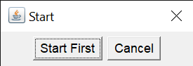
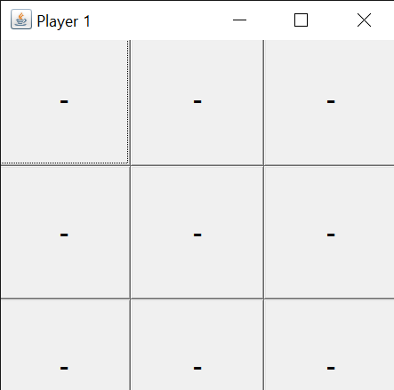
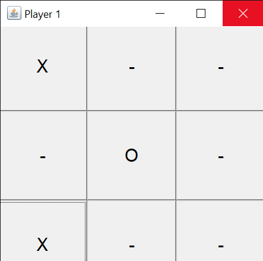
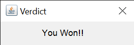
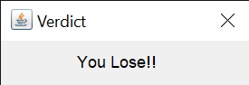

# Cross-PC-Tic-Tac-Toe
In this project, Tic-Tac-Toe game is implemented to be played over internet connection, not just locally in one computer. All you need is a good internet connection and enthusiasm.

This project is purely written in java which is using GUI for the game window and socket programming to communicate with the other player's GUI in his/her PC. 

## How this works?
1. Player that will start first, should run the program and click "Start First". Other player can now run the program and click "Cancel".

2. Then a window will popup, that will be your interface to play game.

3. After a player wins, that player will get the verdict window as "You Won!!" and other player will get "You Lose!!". After that window, the game will terminate.

